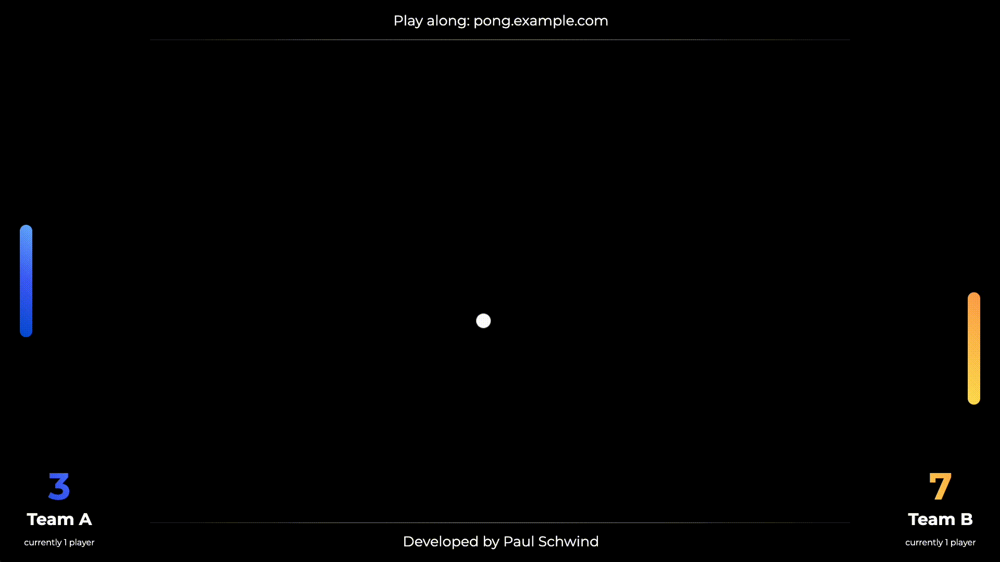
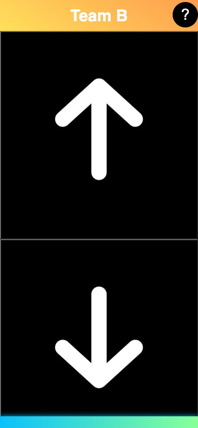
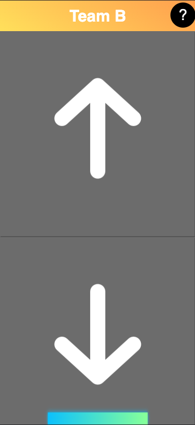

# Team Pong

## Description
This is a variant of the popular arcade game Pong which you can show on a projector or a large screen and play in larger groups, while not requiring everyone to participate all the time.

People can join via the link on the top of the board and play against each other. Each player is assigned a random one of two teams. Every player can move the platform of their respective team. The catch is that for each move command sent by a player, the team platform only moves a little and that players can only send a move command every so often (which is every 1.5 seconds by default). This makes the game more about coordination of players.

## Installation
See [docs/installation.md](./docs/installation.md) for installation instructions.

## Opening and Configuring Board
See [docs/usage.md](./docs/usage.md) for instructions on how to open the board and configure it.

## Game Mechanics
The game works a little different from the original Pong game:
- The more people there are in a team, the better the team can move the platform. This is because the platform moves a little for each move command sent by a player and should encourage different people (e.g. at an event) to play together.
- The balls and the platforms move a lot slower in order for players to be able to coordinate.
- There can be multiple balls in the game.
- The balls bounce off of platforms in similar fashion to the original Pong game, but they always keep their direction in y-direction. Otherwise, the bounce algorithm closely follows the ideas of [this Stack Exchange post](https://gamedev.stackexchange.com/questions/4253/in-pong-how-do-you-calculate-the-balls-direction-when-it-bounces-off-the-paddl/4255#4255).
- The game randomly decides the team of each joining player. However, it tries to keep the teams balanced by assigning players to the team with the fewest players with a probability of 80%.
- After 60 seconds of inactivity, players will become `inactive` as indicated on the top of the clients. This means they are not counted towards the player count necessary to start a game. As soon as a player taps an arrow, they will be active again.

## Contributing
If you want to contribute, you can open a pull request. If you want to add a new feature, please open an issue first to discuss it.

### Translations
To add a new language, create a new file in `frontend/src/translations` with the language code as the filename (e.g. `de.json` for German). Then, copy the contents of `en.json` into the new file and translate the strings. You can then add the language to the `frontend/src/translations/translationInit.js` file.

## License
This project is licensed under the MIT License. See the [LICENSE](./LICENSE) file for details.