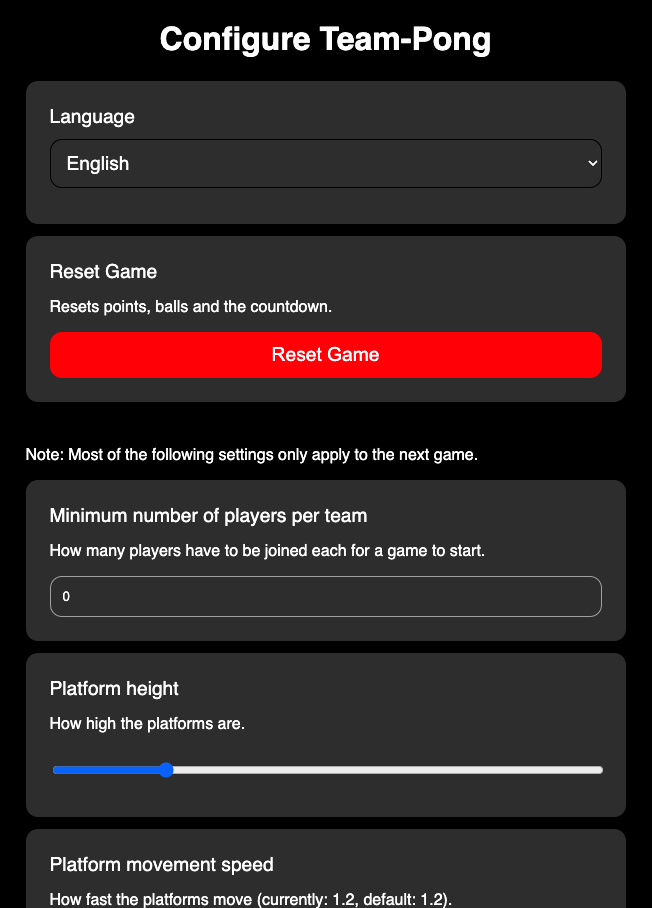

# Opening and Configuring the Board

## Opening the Board
When opening the Pong website, you will be redirected to `<your-server-url>/static/index.html`, which shows the client controls (arrows). To open the board, you need to go to `<your-server-url>/static/index.html?board`. Open it up on a large screen or projector, and you're good to go!

## Configuration
The whole game can be configured on a separate page. Go to `<your-server-url>/static/index.html?config` to open it. You can configure:
- The language of the game (currently only English and German are supported)
- Resetting the game
- The minimum number of players per team for a game to start
- The platform height
- The platform speed
- The cooldown between two moves by a single player
- The number of balls
- The default ball speed
- The maximum ball speed (balls are faster the closer they bounce of off the edge of the platform)
- The countdown time before the game starts
- Whether to play a sound when balls collide with walls or platforms

